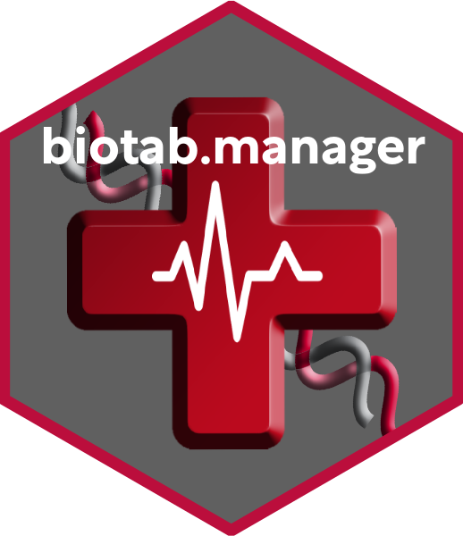

# biotab.manager - Manage TCGA clinical tables 


  

_**biotab.manager** is a R package allowing you to download, manage, subset, and aggregate TCGA patients clinical data (biotabs) from the GDC portal. The package is built upon TCGAbiolinks to query TCGA databases, and makes use of R data.table handle queries results._  

**Author: PAGEAUD Y.<sup>1</sup>**  
**1-** [**DKFZ - Division of Applied Bioinformatics, Germany.**](https://www.dkfz.de/en/applied-bioinformatics/index.php)  

**How to cite:** _Pageaud Y. et al., biotab.manager - Manage TCGA clinical tables._  
  
  
  
  

## Content
Currently the package BiocompR contains **8 functions**:

* `dt.develop()` - Develops a data.table row if it contains information for more than 1 sample.  
* `get.ls.TCGA.biotab()` - Returns a list of biotabs, one biotab per TCGA project.  
* `get.TCGA.biotab()` - Returns a biotab for a given TCGA project ID.  
* `get.TCGA.clinical()` - Collects patients clinical data from specific TCGA projects.  
* `ICGC.to.TCGA.project()` - Convert TCGA project ID into ICGC cohort and vice versa.  
* `multi.subset.biotab()` - Multi-step clinical biotabs subsetting following a type of data and its manifest.  
* `subset.clinical.biotab()` - Subset clinical biotabs following a type of data and its manifest.  
* `TCGA.clinical.as.dt()` - Subset clinical data from collected patients clinical data, and return it into a data.table.  

## Prerequisites
### Install Bioconductor dependencies
In R do:
```R
if (!requireNamespace("BiocManager", quietly = TRUE))
    install.packages("BiocManager")

BiocManager::install("TCGAbiolinks")
```
### Install CRAN dependencies
```R
inst.pkgs = c('data.table', 'simsalapar')
install.packages(inst.pkgs)
```

## Installing
1. In the Git repository click on "Clone or Download".
2. Copy the HTTPS link.
3. Open a terminal and type:
```bash
git clone https://github.com/YoannPa/biotab.manager.git
```
4. Open the folder BiocompR and open the "biotab.manager.Rproj" file in RStudio.
5. In the RStudio console, type:
```R
devtools::install()
```

## Problems ? / I need help !
For any questions **Not related to bugs or development** please check the section "**Known Issues**" available below. If the issue you experience is not adressed in the known issues you can write me at [y.pageaud@dkfz.de](y.pageaud@dkfz.de).  

### Known Issues
No issues reported yet for the package.  

## Technical questions / Development / Feature request
If you encounters issues or if a feature you would expect is not available in a BiocompR function, please check if an existing issue adresses your point [here](https://github.com/YoannPa/biotab.manager/issues/). If not, create a [new issue here](https://github.com/YoannPa/biotab.manager/issues/new).  

## References
1. [_Colaprico, A. et al. TCGAbiolinks: an R/Bioconductor package for integrative analysis of TCGA data. **Nucleic Acids Research 44, e71–e71 (2016)**._](https://academic.oup.com/nar/article/44/8/e71/2465925)
2. [_The Cancer Genome Atlas Research Network et al. The Cancer Genome Atlas Pan-Cancer analysis project. **Nature Genetics 45, 1113–1120 (2013)**._](https://www.nature.com/articles/ng.2764)
3. [_Grossman, Robert L., Heath, Allison P., Ferretti, Vincent, Varmus, Harold E., Lowy, Douglas R., Kibbe, Warren A., Staudt, Louis M. (2016) Toward a Shared Vision for Cancer Genomic Data. **New England Journal of Medicine 375:12, 1109-1112.**_](https://www.nejm.org/doi/10.1056/NEJMp1607591)
4. Official R data.table Github repository: [https://github.com/Rdatatable/data.table](https://github.com/Rdatatable/data.table)

